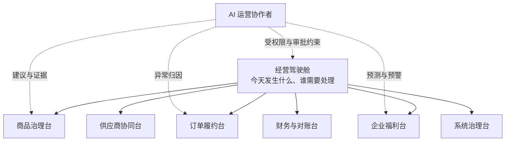
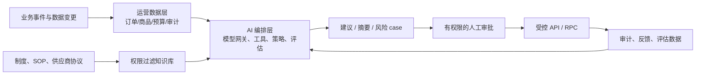

# Smart Wing 后台进化至 100 分与 AI 架构详细解构

生成时间：2026-08-09  
定位：把当前 60 分静态概念 Demo，演进为可运营、可扩展、可审计的企业福利商城经营操作系统。

---

## 0. 一句话目标

做的不是“一个有侧边栏的后台”，而是一个让运营人员在 30 秒内看清问题、在 3 分钟内做出正确动作、并让每次动作可追溯的**企业福利电商操作系统**；AI 是受权限、证据和人工审批约束的运营协作者，不是无边界聊天机器人。

## 1. 60 分版本为什么只有 60 分

当前 Demo 有正确方向：待办驱动、商品治理、订单异常、预算预警。但它距离生产后台仍缺少四个层次。

| 层次 | 60 分现状 | 100 分应有状态 |
|---|---|---|
| 视觉与信息 | 一页静态看板 | 按角色定制的工作台；对象、状态、风险与下一步一目了然 |
| 业务闭环 | 点击只改变文案 | 每个待办可筛选、处理、审批、回滚、留痕、通知 |
| 数据可信度 | 演示数据 | 实时或准实时数据，明确更新时间、来源和计算口径 |
| 运营智能 | 人工发现问题 | 规则 + AI 主动发现异常，给出带证据的建议，但关键动作必须审批 |

100 分不等于“功能越多越好”。衡量标准是：运营人员不需要打开数据库、不需要问研发、不需要靠记忆，就能把商品、订单、预算和风险处理到位。

---

## 2. 产品总架构：一个驾驶舱，六个工作台



### 2.1 经营驾驶舱：不展示“数据”，展示“决定”

首页只保留四类信息：

1. **必须立即处理**：阻断交易、临近 SLA、资金或安全风险。
2. **今天的经营结果**：GMV、预算消耗、员工活跃、履约健康度，与目标和同期比较。
3. **需要确认的建议**：AI/规则生成、附带原因和影响范围。
4. **系统健康**：供应商接口、库存同步、支付回调、数据任务、告警。

每一张卡必须包含：影响金额/人数、发生时间、责任人、SLA、根因摘要、主操作按钮和详情入口。没有操作价值的图表不放首页。

### 2.2 商品治理台：从“商品表格”变成发布流水线

商品状态机：`草稿 → 已导入 → 待补全 → 待分类审核 → 待发布审核 → 已发布 → 已下架/归档`。

| 区域 | 必须能力 |
|---|---|
| 商品队列 | 按供应商、企业、类目、风险、缺失字段、审核人和状态筛选；支持批量处理 |
| 商品详情 | SPU/SKU、价格、库存、图文、供应商、适用企业、历史版本、变更差异 |
| 分类审核 | AI 建议三级类目与置信度；人工对比、修正和确认；低置信度自动进入复核队列 |
| 发布中心 | 发布前校验：类目、价格、库存、协议、图片、企业可见范围；支持定时发布与一键回滚 |
| 审计 | 谁在何时以什么理由改变了价格、库存、类目、可售范围与状态 |

当前“10 个商品存在却不可见”的问题，在该工作台必须显示为：`10 个商品待分类审核 → 缺少 taxonomy_l1/l2/l3、置信度 0 → 建议处理人 → 批量审核`，而非前台空白。

### 2.3 订单履约台：以订单问题而不是订单列表组织工作

订单应是完整事件流：创建、库存预占、支付、供应商接单、发货、签收、售后、退款、对账。

- 默认视图：异常订单、临近 SLA、等待人工、退款风险，而不是所有订单。
- 单订单页：客户权益、商品快照、资金分摊、库存变动、供应商事件、客服记录、操作审计放在同一时间线。
- 操作须有护栏：退款、补偿、改价、强制关单必须说明原因、二次确认、权限校验与审计。
- 所有外部调用具备幂等键、重试记录和人工接管入口。

### 2.4 企业福利台：这是 Smart Wing 与普通商城最大的不同

企业福利后台的核心对象不是“消费者”，而是：`企业 → 福利计划 → 部门/人群 → 预算 → 资格 → 可见商品 → 使用结果`。

必须支持：预算包、发放周期、余额来源、可购类目、员工资格、组织同步、审批流、企业专属价、预算预警、归属报表和审计导出。

### 2.5 供应商、财务与治理台

- **供应商协同**：商品导入质量、库存延迟、履约 SLA、结算单、异常重试、供应商评分。
- **财务与对账**：订单、支付、退款、账户流水三方勾稽；任何差异必须形成可处理 case。
- **系统治理**：组织、角色、权限范围、集成凭据、接口健康、审计、数据保留和告警规则。

---

## 3. 100 分交互标准

### 3.1 对象优先，而非菜单优先

后台最重要的对象只有：商品、订单、企业、员工、预算、供应商、结算单、告警。任何页面都应让用户快速进入对象详情，并看到其上下游关系。

### 3.2 Case（问题单）优先，而非通知优先

“库存不足”“商品未分类”“供应商超时”不应只是红点，而应生成可关闭的 case：

`发现 → 分级 → 指派 → 处理 → 验证 → 关闭 → 复盘`。

### 3.3 不可逆操作必须可解释

退款、预算调整、商品发布、权限提升、供应商结算必须显示影响范围；系统记录操作人、审批人、理由、前后值和关联证据。

### 3.4 统一全局搜索与命令入口

支持搜索订单号、商品、员工、企业、供应商、退款号；也支持命令式动作，例如“查看华北大区本月预算异常”。搜索结果受数据范围权限约束。

---

## 4. AI 架构：让 AI 成为受控运营协作者

### 4.1 AI 的正确位置

AI 不拥有最终业务权力。它负责**发现、总结、建议、填充、解释、编排**；人或确定性规则负责**发布、退款、扣款、授权、删除、对外发送**。



### 4.2 四层 AI 平台

| 层 | 职责 | 必须约束 |
|---|---|---|
| 数据层 | 业务事件、指标快照、文档、审计记录 | 脱敏、数据分级、保留期限、租户隔离 |
| 知识层 | SOP、商品规则、供应商协议、帮助文档的检索 | 检索前按企业/角色/数据范围过滤，不能跨租户召回 |
| 编排层 | 模型网关、Prompt 模板、工具调用、工作流 | 模型可替换；Prompt/模型/工具版本全部留痕 |
| 治理层 | 权限、审批、评估、红队、成本、监控 | 高风险工具默认只读；写操作必须逐次确认或走审批单 |

### 4.3 AI Agent 的工具权限分级

| 等级 | 示例 | 是否可自动执行 |
|---|---|---|
| L0 解释 | 总结订单、解释指标、回答 SOP | 可以，仅读取被授权数据 |
| L1 建议 | 推荐类目、预测预算、识别异常、生成回复草稿 | 可以生成，但必须展示证据和置信度 |
| L2 编排 | 创建审核 case、分派负责人、发起库存核查 | 可自动创建低风险草稿；指派/通知依策略确认 |
| L3 业务写入 | 发布商品、调整价格、退款、预算调整 | 必须由有权限人员确认，关键操作可双人复核 |
| L4 外部行动 | 给供应商下单、支付、发送对外正式通知 | 默认禁止自动执行；仅通过审批工作流调用 |

### 4.4 第一批真正值得做的 AI 能力

1. **商品分类 Copilot**：按标题、属性、图片、供应商类目给出三级类目和置信度；低置信度进入人工审核，审核反馈形成评估集。
2. **运营异常 Copilot**：汇总订单、库存、预算、接口事件，把“发生了什么、影响谁、可能原因、建议动作”变为 case。
3. **订单处理 Copilot**：为客服/运营生成订单时间线、退款核查清单和供应商催办草稿，不直接退款或发消息。
4. **福利顾问 Copilot**：为企业管理员解释预算与使用趋势，生成福利计划建议；只使用已授权的聚合数据。
5. **数据问答 Copilot**：将“华北大区为什么超预算”转换为受权限约束的指标查询与图表，而不是让模型自由拼 SQL。

### 4.5 AI 绝不能做的事

- 读取或输出 service key、数据库密码、访问码、Cookie、地址明文。
- 绕过角色、企业、部门或数据范围权限。
- 自动退款、自动改价、自动发布商品、自动扣减预算。
- 把私有订单/员工数据用作公共模型训练数据。
- 在没有可验证证据时编造库存、政策、退款结果或经营数字。

---

## 5. 目标技术架构

### 5.1 近期：模块化单体，不拆微服务

保留当前 `worker/api` + Supabase RPC 的事务边界，前端按工作台拆分模块。新增以下内部边界：

```text
apps/
  admin/                 # 运营后台（独立路由、设计系统、权限壳）
  storefront/            # 员工商城
packages/
  api-contract/          # 输入输出 schema、错误码、SDK
  domain/                # 商品、订单、预算、权限领域规则
  design-system/         # 后台与商城共享设计 token
services/
  api/                   # BFF：认证、授权、编排
  worker/                # 后续异步任务：导入、同步、通知、AI 评估
supabase/migrations/     # 唯一数据库演进来源
```

当前项目不需要立即迁移 monorepo；先按这一边界整理代码即可。真正的独立服务只在供应商同步、支付回调、AI 批处理、搜索索引等出现独立伸缩需求后引入。

### 5.2 数据与事件

新增或完善：`sessions`、`role_assignments`、`approval_cases`、`case_events`、`catalog_reviews`、`integration_runs`、`outbox_events`、`ai_runs`、`ai_evaluations`。

所有重要写入采用 outbox：业务事务成功后写事件，异步消费者负责通知、搜索索引、供应商同步、指标计算和 AI case 生成。消费者必须幂等、可重试、可死信处理。

### 5.3 可观测性

每次请求、订单、供应商同步、AI 工具调用拥有关联 ID。看板至少覆盖：

- P50/P95 延迟、错误率、应用重启、数据库连接数；
- 下单失败、库存冲突、支付/退款差异、供应商 SLA；
- AI 建议采纳率、人工推翻率、幻觉/策略拦截率、单任务成本；
- 审核队列积压、预算异常、权限拒绝与安全事件。

---

## 6. 从 60 分到 100 分的实施路线

### 里程碑 1：80 分 — 可运营（先做）

- 做出真实商品治理台，处理当前 10 个待分类商品。
- 后台接入真实 API，移除静态 Demo 数据。
- 实现 case 队列、对象详情、审核记录、批量发布和权限校验。
- 建立订单异常队列与订单时间线。
- 将 root、数据库、服务密钥完成分离与轮换。

验收：运营人员无需数据库权限，可独立完成“导入商品 → 分类审核 → 发布 → 员工端可见”。

### 里程碑 2：90 分 — 可协同、可审计

- 企业预算与资格规则上线；支持审批和组织同步。
- 供应商库存/履约同步、重试与人工接管。
- 订单、账户、支付、退款的完整对账中心。
- 可吊销 session、范围权限、操作审计、告警与备份恢复演练。

验收：每一笔资金和每一个商品发布动作都可定位责任人、前后值与证据；异常可在 SLA 内闭环。

### 里程碑 3：95 分 — AI 辅助运营

- 商品分类 Copilot 与人工审核闭环。
- 异常归因、运营日报和知识问答。
- AI run、证据、模型版本、人工反馈和评估指标全量留痕。
- L0/L1 自动化，L2/L3/L4 全部纳入审批策略。

验收：AI 建议有证据、可撤回、可评估；错误建议不会直接影响商品、预算、订单或资金。

### 里程碑 4：100 分 — 平台化与规模化

- 多企业/多商城/多供应商稳定隔离；完整企业级权限和合规能力。
- 压测后多实例、缓存、队列、搜索、对象存储和灾备到位。
- 小程序/原生 App 复用同一 API 契约，独立实现体验层。
- AI 成为运营体系的一部分：指标、队列、审批、审计、成本和评估统一治理。

验收：系统在增长、故障、审计和人员更替时仍可稳定运行；运营能力不依赖少数开发人员的记忆。

---

## 7. 需要先做的三个决定

1. 是否授权先完成 10 个商品的人工分类与发布，作为商品治理台的第一条真实闭环？
2. 后台的第一使用者是谁：商城运营、企业 HR、供应商运营，还是财务？首页与权限应由这个答案决定。
3. AI 的第一目标是“商品分类提效”还是“运营异常处理”？不要同时开五个 Agent，先用一个高频、可评估、可人工兜底的场景做成闭环。

