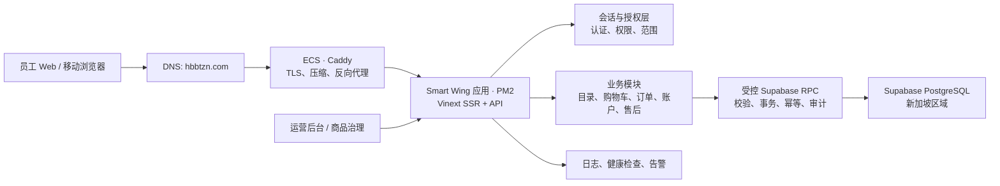

# Smart Wing 系统架构设计与实施蓝图

生成时间：2026-08-09  
适用范围：当前已上线 MVP，以及面向正式企业福利商城的演进目标。  
架构原则：先保持单体可运营，再按明确瓶颈拆分；不为了“微服务”而微服务。

## 1. 架构结论

系统近期应采用**模块化单体 + 托管 PostgreSQL + 受控 RPC**架构：一套 Web 应用承载 SSR、页面与 API，业务边界在代码和数据库事务层清晰分隔。当前 8 核 / 14 GiB ECS 足以支撑 MVP；当压测和套餐限制确认后，再扩展为多实例应用层、缓存和异步任务。

当前线上真实路径为阿里云 ECS + Caddy + PM2 + Vinext/React + Supabase PostgreSQL（新加坡）。浏览器绝不持有 Supabase `service_role` 密钥；所有敏感读写经服务端 API 和数据库 RPC 完成。

## 2. 分层与职责

| 层 | 当前实现 | 正式版职责与约束 |
|---|---|---|
| 接入层 | Caddy、HTTPS、`hbbtzn.com` | TLS、限流/WAF、压缩、请求 ID；仅暴露 80/443，SSH 仅限运维来源。 |
| 体验层 | React 19、Vinext SSR、响应式设备皮肤 | 复用设计 token 和 API SDK；Web、PWA、小程序、App 不共享页面代码，但共享契约与领域模型。 |
| BFF/API 层 | `worker/api/*` | HTTP、会话、鉴权、参数校验、错误码、PII 加密编排；不直接由浏览器访问数据库。 |
| 领域层 | catalog / cart / order / account / after-sale | 聚合业务规则，尤其库存、金额、支付和退款；金额统一为整数分。 |
| 数据层 | Supabase PostgreSQL + migrations + RPC | 所有写入走 `security definer` RPC；迁移只增不改；流水与审计只追加。 |
| 异步与集成层 | 尚未独立建设 | 后续接入供应商库存、支付回调、通知、报表时，引入队列和幂等消费者。 |
| 运维层 | PM2、Caddy、健康检查 | CI 门禁、结构化日志、指标、备份与演练；不依赖人工 SSH 作为常规发布手段。 |

## 3. 核心业务边界

### 3.1 身份、租户与授权

目标上下文为 `tenant → enterprise → mall → member`。每个 API 请求在授权层解析 actor，并用“权限 + 数据范围”判断访问；不能只凭前端路由或角色数组放行。

- 当前 MVP：演示访问码 + 签名 Cookie，仅适合验收。
- 正式版：企业 SSO / OAuth / 微信身份入口，服务端 session 表支持吊销、设备管理和审计。
- 授权：引入 `authorize(actor, permission, scope)`，覆盖账户、订单、后台运营、财务和退款接口。

### 3.2 商品与商品治理

商品的公开可见性不能只由 `status=active` 决定。正式发布条件为：供应商数据完整、三级分类合法、分类置信度达标或人工审核通过、库存和价格有效。

当前生产库的 10 个商品因三级分类与置信度为空而被目录 RPC 隐藏。这是正确的治理保护，但需要运营端提供“分类建议 → 人工审核 → 发布”的闭环，而不是绕过目录规则。

### 3.3 交易域

购物车、下单、扣款、退款均以数据库 RPC 为事务边界：

1. API 校验会话、权限、输入与幂等键。
2. RPC 锁定库存和账户，创建订单/流水/审计事件。
3. 外部支付或供应商调用改为异步工作流；回调按幂等键落库。
4. 读模型为订单、账户和对账页提供查询，避免前端拼接财务状态。

## 4. 目标部署拓扑

| 阶段 | 应用层 | 数据与缓存 | 适用条件 |
|---|---|---|---|
| 当前 MVP | 单台 ECS，PM2 单实例，Caddy | Supabase PostgreSQL | 演示、内测、低并发。 |
| 可承受高峰 | PM2 约 6 个 cluster 实例；静态资源 CDN | 升级后的 Supabase / PostgreSQL 连接池；Redis 用于限流和短期缓存 | 完成带宽、数据库限额与压测确认后。 |
| 正式生产 | 至少双应用实例 + 负载均衡；蓝绿/滚动发布 | 境内合规数据库（如要求）、主从/备份、Redis、对象存储 | 企业客户、明确 SLA、数据合规与供应商对接。 |

不要在未确认 ECS 带宽、Supabase 连接/速率额度和压测基线前宣称支持“1000 人同时发起交易”。集群实例数也必须与数据库连接预算一起确定。

## 5. API 与数据契约

- API 版本统一为 `/api/v1/*`；健康检查独立为 `/api/health`。
- API 返回统一错误信封、请求 ID 和安全响应头；领域异常映射为稳定错误码。
- 前端只通过 `src/services/productionApi.ts` 调用 API；删除页面层直连 mock/数据库的路径。
- 数据库 schema 的唯一权威是 `supabase/migrations/`；废弃 D1/Drizzle 遗留文件，不再双轨维护。
- API 契约使用 OpenAPI 或 TypeScript schema 自动生成客户端类型和契约测试，避免前后端分类字段漂移。

## 6. 安全、合规与可靠性

1. 秘钥只存服务器密钥文件/密钥管理服务；轮换服务器 root、数据库密码、Supabase service key 与会话密钥，彼此不得复用。
2. PII 使用应用层 AES-256-GCM 加密，密钥分版本管理；日志不得记录访问码、Cookie、地址明文或服务端密钥。
3. 生产数据存储地需要甲方/法务书面确认。若要求境内存储，迁移到阿里云 RDS PostgreSQL 或等价合规服务，并自建受控 REST/RPC 层。
4. Caddy 继续处理证书；增加安全组最小化、SSH 仅密钥认证、失败登录限制、备份与恢复演练。
5. 建立 SLO：可用性、P95 API 延迟、错误率、订单创建失败率、库存超卖数、队列积压和数据库连接占用。

## 7. 实施路线图

### 阶段 A：使 MVP 可验收

- 完成 10 个现有商品的三级分类审核并发布。
- 用真实演示账户走通登录、商品、加购、下单、扣款、售后读取链路。
- 将 `npm run quality` 恢复为可作为 CI 门禁的全绿状态；处理依赖审计告警，不直接执行破坏性升级。
- 将部署命令固化为 CI/CD；服务器只从受保护分支发布。

### 阶段 B：使业务可运营

- 实现管理员商品审核、供应商导入、库存同步、订单履约与退款工作台。
- 引入可吊销 session、权限范围、后台操作审计和告警。
- 接入对象存储、图片处理、备份、可观测性和发布回滚。

### 阶段 C：使系统可扩展

- 用压测结果将应用层升级到 PM2 cluster / 多实例，并设置连接池上限和缓存策略。
- 将供应商、支付、通知等慢操作改为消息队列任务；消费者必须幂等、可重试、可追踪。
- 有明确上架需求后，独立建设 Taro/uni-app 小程序或 React Native/Flutter 客户端；继续复用 API 与领域契约。

## 8. 当前必须决策的事项

1. 是否授权将已导入的 10 个商品按运营规则完成分类并发布？
2. 数据必须境内存储，还是可继续使用新加坡 Supabase？
3. 近期是否有微信小程序或原生 App 上架日期？
4. ECS 实际带宽与 Supabase 套餐额度是多少？这些决定集群、缓存和 CDN 的投入时点。

